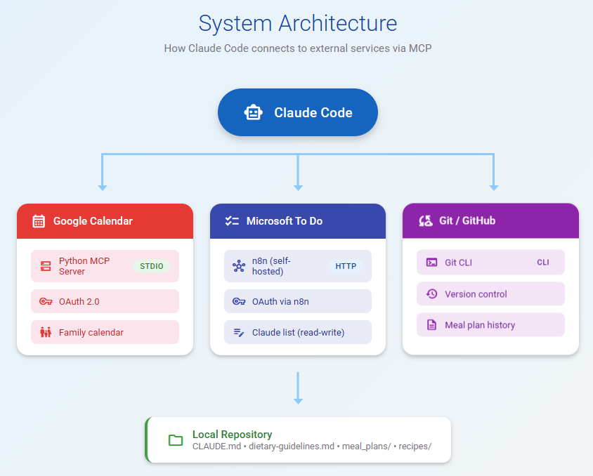
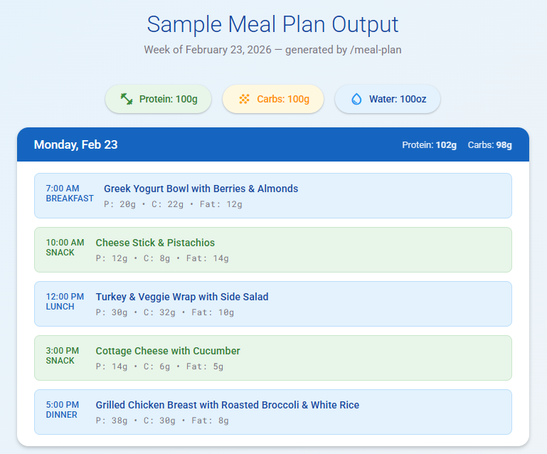

# Building an AI-Powered Meal Planner with Claude Code, Google Calendar, and Microsoft To Do

Managing a specialized diet is hard. Managing a specialized diet while also planning meals for a week, building shopping lists, and keeping your calendar organized? That's a full-time side job.

I'm on a GLP-1 medication, which comes with specific nutritional requirements — minimum carb thresholds, protein targets spread throughout the day, and a list of foods to avoid. Every week I was spending time planning meals, cross-referencing macros, writing shopping lists, and manually adding events to the family calendar. It was tedious, repetitive, and exactly the kind of work that AI should be doing.

So I built a system that does all of it. One command generates a full week of meals, adds them to Google Calendar, creates a shopping list in Microsoft To Do, and commits the plan to Git — all with approval checkpoints so I stay in control.

Here's how I put it together.

## The Problem

My dietary requirements aren't something a generic meal planning app handles well:

- **100g protein daily** from specific sources (chicken, beef, pork, turkey, beans, nuts, Greek yogurt, eggs — but no fish, no tofu, no chicken thighs)
- **100g carbs daily** with a minimum of 50g (critical on GLP-1 medication to avoid low blood sugar)
- **Fiber counts toward carb totals** (no net carb math)
- **Leftovers strategy** — if I cook a protein for dinner, lunch the next day should use the leftovers
- Meals spread across breakfast, snack, lunch, snack, dinner with macros balanced throughout

On top of that, I wanted the shopping list optimized by store preference (Aldi first, then Costco, then Sam's Club) and the meals to appear on my family's shared Google Calendar so everyone knows what's for dinner.

No app does all of this. But Claude Code with the right integrations does.

## The Architecture

The system is a Git repository with structured markdown files, connected to external services through MCP (Model Context Protocol) servers:

```
menu/
├── .claude/
│   └── commands/
│       └── meal-plan.md   # The /meal-plan workflow definition
├── articles/              # Write-ups like this one
├── docs/
│   ├── dietary-guidelines.md
│   ├── meal-plan-workflow.md
│   └── shopping-guidelines.md
├── meal_plans/            # Generated plans (YYYY-MM-DD.md)
├── recipes/               # Recipe ideas to incorporate
├── .mcp.json              # MCP server configuration
└── CLAUDE.md              # Instructions Claude follows every session
```



Three systems are integrated:

1. **Google Calendar** — via a Python MCP server using OAuth, to schedule meal events on the Family calendar
2. **Microsoft To Do** — via n8n (self-hosted automation platform) exposing an MCP endpoint, to manage shopping lists
3. **Git/GitHub** — for version control and history of all meal plans

## Setting Up Google Calendar Integration

The Google Calendar connection uses a [Python-based MCP server](https://github.com/deciduus/calendar-mcp) that communicates with Claude Code over stdio.

The setup involves creating OAuth credentials in Google Cloud Console, enabling the Calendar API, and running through the OAuth flow once to save tokens locally. The MCP server is then registered in the project's `.mcp.json`:

```json
{
  "mcpServers": {
    "google-calendar": {
      "type": "stdio",
      "command": "python",
      "args": ["~/git/calendar-mcp/run_server.py"]
    }
  }
}
```

One lesson learned the hard way: **always include timezone offsets in ISO timestamps**. Without `-06:00` for Central time, the Calendar API interprets times as UTC, and every meal shows up six hours early. This is now documented in both `CLAUDE.md` and the project's memory so Claude never forgets.

## Setting Up Microsoft To Do via n8n

Rather than building another custom MCP server, I used [n8n](https://n8n.io) — a self-hosted workflow automation platform — to bridge Claude Code to Microsoft To Do.

n8n runs locally via Docker and exposes an MCP endpoint over HTTP. The configuration in `.mcp.json` is straightforward:

```json
{
  "n8n-todo": {
    "type": "http",
    "url": "http://localhost:5678/mcp/<your-workflow-id>"
  }
}
```

This gives Claude access to five operations: list all To Do lists, get tasks, create tasks, update tasks, and delete tasks. I set up access rules so that the shared **Groceries** list is read-only (my family uses it too), while a dedicated **Claude** list is read-write for the AI to manage.

## The CLAUDE.md File: Teaching Claude the Rules

The real power of this setup is `CLAUDE.md` — a project-level instruction file that Claude Code reads at the start of every conversation. It contains:

- **Dietary guidelines** — all the macro targets, allowed foods, exclusions, and medical notes
- **Shopping strategy** — store preferences, cost optimization goals
- **Scheduling rules** — which calendar to use, meal times for weekdays vs weekends, timezone requirements
- **Access controls** — which To Do lists Claude can write to
- **File conventions** — where to save plans, naming format

This means I don't have to re-explain my diet every session. Claude comes in already knowing the rules and ready to work.

## The /meal-plan Command

The workflow is defined as a custom slash command in `.claude/commands/meal-plan.md`. When I type `/meal-plan`, Claude executes a 7-step pipeline:

1. **Determine the target week** — calculates next Monday through Sunday and confirms the dates with me
2. **Review guidelines and history** — reads dietary rules, shopping preferences, recent meal plans (to avoid repeats), and any saved recipes
3. **Generate the meal plan** — creates a full 7-day plan with macro breakdowns per meal and daily totals
4. **Save the plan** — writes it to `meal_plans/YYYY-MM-DD.md`
5. **Update Microsoft To Do** — diffs the shopping list against existing items on the Claude list, creates missing tasks, and marks needed items as high importance
6. **Update Google Calendar** — builds 21 events (3 meals x 7 days) with proper timezone offsets, presents them in a table for review, then creates them on the Family calendar
7. **Git commit and push** — stages, commits, and pushes the new meal plan

The workflow pauses for my approval at four points: date range confirmation, meal plan review, To Do changes, and calendar events. This keeps me in control while automating the tedious parts.


## What a Generated Meal Plan Looks Like

Each meal plan is a structured markdown file with:

- A header showing the week and daily macro targets
- A core ingredients summary (proteins and staples used across multiple meals)
- Seven days of meals, each with item-level macro breakdowns
- A shopping list organized by store with estimated prices
- Meal prep tips for the week

The leftover strategy is baked in — if Monday's dinner is grilled chicken, Tuesday's lunch uses that chicken in a wrap or salad. This minimizes cooking and waste.



## Lessons Learned

**Start with the instructions, not the code.** The most important file in this project is `CLAUDE.md`. Getting the dietary rules, scheduling, and access controls documented clearly made everything else work smoothly.

**MCP servers are the integration layer.** Rather than building a monolithic application, MCP lets Claude Code talk to external services natively. The Google Calendar server and n8n bridge are independent, reusable components.

**Approval gates matter.** The workflow pauses four times for human review. This isn't a limitation — it's a feature. I catch mistakes, swap out meals I'm not in the mood for, and adjust quantities before anything hits my calendar or shopping list.

**Timezone bugs are silent and painful.** Calendar events showing up at 1 AM instead of 7 AM taught me to always specify timezone offsets. Now it's enforced at the instruction level.

**n8n is a great MCP bridge.** For any service that has an API but no MCP server, n8n can fill the gap with minimal setup. The Docker deployment takes minutes and the MCP endpoint just works.

## What's Next

The foundation is solid. Future improvements I'm considering:

- **Recipe library** — building out the `recipes/` directory so Claude can rotate through tested favorites
- **Nutritional tracking** — comparing planned vs actual intake
- **Seasonal adjustments** — adapting meal plans based on what's in season and on sale
- **Cost tracking** — recording actual grocery spending against estimates

## Try It Yourself

The core pattern here is reusable for any domain where you need AI to follow specific rules and coordinate across multiple services:

1. Define your rules in `CLAUDE.md`
2. Connect external services via MCP servers
3. Build a workflow as a custom command
4. Add approval gates where human judgment matters

Claude Code isn't just a code assistant — it's a platform for building personal automation that understands your specific needs and integrates with your existing tools.
