# Meal Plan Workflow

## Overview

This diagram shows the end-to-end flow of the `/meal-plan` command, which generates a weekly meal plan, updates the shopping list, schedules calendar events, and commits the result.

```mermaid
%%{init: {'theme': 'base', 'themeVariables': {
  'primaryColor': '#e3f2fd',
  'primaryTextColor': '#0d47a1',
  'primaryBorderColor': '#90caf9',
  'lineColor': '#64b5f6',
  'fontFamily': 'Segoe UI, Roboto, sans-serif',
  'fontSize': '13px',
  'clusterBkg': '#ffffff',
  'clusterBorder': '#90caf9',
  'edgeLabelBackground': '#ffffff'
}}}%%

flowchart TD
    Start@{ shape: stadium, label: "▶ &ensp; /meal-plan invoked" }

    Start --> S1

    subgraph S1["① &ensp; Determine Target Week &emsp; 📅"]
        S1a("Calculate next Monday – Sunday dates")
    end

    S1 --> G1

    G1@{ shape: diam, label: "🔒 User confirms date range?" }
    G1 -- "✗ &ensp;Revise" --> S1
    G1 -- "✓ &ensp;Confirm" --> S2

    subgraph S2["② &ensp; Review Guidelines & History &emsp; 📖"]
        S2a("📄 Read dietary-guidelines.md ∣ filesystem")
        S2b("📄 Read shopping-guidelines.md ∣ filesystem")
        S2c("🕐 Read most recent meal plan ∣ filesystem")
        S2d("🍽️ Read recipes/ for ideas ∣ filesystem")
        S2a --> S2b --> S2c --> S2d
    end

    S2 --> S3

    subgraph S3["③ &ensp; Generate Meal Plan &emsp; ✨"]
        S3a("Create 7-day plan following dietary & shopping guidelines")
        S3b("Include daily macros, core ingredients, shopping list, meal prep tips")
        S3a --> S3b
    end

    S3 --> G3

    G3@{ shape: diam, label: "🔒 User approves meal plan?" }
    G3 -- "✗ &ensp;Revise" --> S3
    G3 -- "✓ &ensp;Approve" --> S4

    subgraph S4["④ &ensp; Save Meal Plan &emsp; 💾"]
        S4a("📁 Save to meal_plans/YYYY-MM-DD.md ∣ filesystem")
    end

    S4 --> S5

    subgraph S5["⑤ &ensp; Update Microsoft To-Do &emsp; ☑️"]
        S5a("☁️ Fetch existing tasks from Claude list ∣ n8n MCP")
        S5b("🔀 Diff shopping list vs existing tasks")
        S5c("➕ Create tasks for missing ingredients ∣ n8n MCP")
        S5d("❗ Mark needed items as high importance ∣ n8n MCP")
        S5a --> S5b --> S5c --> S5d
    end

    S5 --> G5

    G5@{ shape: diam, label: "🔒 User confirms To-Do changes?" }
    G5 -- "✗ &ensp;Revise" --> S5
    G5 -- "✓ &ensp;Confirm" --> S6

    subgraph S6["⑥ &ensp; Update Google Calendar &emsp; 📆"]
        S6a("📋 Build 21 meal events — 3 meals × 7 days")
        S6b("🕐 Apply CST offset -06:00 to all timestamps")
        S6c("📊 Present events table for review")
        S6a --> S6b --> S6c
    end

    S6 --> G6

    G6@{ shape: diam, label: "🔒 User confirms calendar events?" }
    G6 -- "✗ &ensp;Revise" --> S6
    G6 -- "✓ &ensp;Confirm" --> S6w

    S6w("☁️ Create events on Family calendar ∣ Calendar MCP")
    S6w --> S7

    subgraph S7["⑦ &ensp; Git Commit & Push &emsp; 🔄"]
        S7a("➕ Stage new and changed files ∣ git")
        S7b("📝 Commit with descriptive message ∣ git")
        S7c("🚀 Push to main branch ∣ git")
        S7a --> S7b --> S7c
    end

    S7 --> Done

    Done@{ shape: stadium, label: "✔ &ensp; Workflow Complete" }

    Done --> Summary

    subgraph Summary["📊 &ensp; Final Summary Output"]
        R1("📄 Meal plan file path")
        R2("☑️ To-Do items added / updated")
        R3("📅 Calendar events created")
        R4("🔗 Git commit hash & push status")
    end

    %% ── Start / End pills ──
    style Start fill:#1565c0,color:#fff,stroke:#0d47a1,stroke-width:2px,rx:24
    style Done fill:#1565c0,color:#fff,stroke:#0d47a1,stroke-width:2px,rx:24

    %% ── Approval gates — amber ──
    style G1 fill:#fff8e1,color:#e65100,stroke:#ffb300,stroke-width:2px
    style G3 fill:#fff8e1,color:#e65100,stroke:#ffb300,stroke-width:2px
    style G5 fill:#fff8e1,color:#e65100,stroke:#ffb300,stroke-width:2px
    style G6 fill:#fff8e1,color:#e65100,stroke:#ffb300,stroke-width:2px

    %% ── Step cards — blue headers via subgraph ──
    style S1 fill:#fff,color:#0d47a1,stroke:#90caf9,stroke-width:2px,rx:16
    style S2 fill:#fff,color:#0d47a1,stroke:#90caf9,stroke-width:2px,rx:16
    style S3 fill:#fff,color:#0d47a1,stroke:#90caf9,stroke-width:2px,rx:16
    style S4 fill:#fff,color:#0d47a1,stroke:#90caf9,stroke-width:2px,rx:16
    style S5 fill:#fff,color:#0d47a1,stroke:#90caf9,stroke-width:2px,rx:16
    style S6 fill:#fff,color:#0d47a1,stroke:#90caf9,stroke-width:2px,rx:16
    style S7 fill:#fff,color:#0d47a1,stroke:#90caf9,stroke-width:2px,rx:16
    style Summary fill:#fff,color:#0d47a1,stroke:#90caf9,stroke-width:2px,rx:16

    %% ── Action nodes — light blue rounded ──
    style S1a fill:#e3f2fd,color:#1565c0,stroke:#90caf9,stroke-width:1.5px
    style S3a fill:#e3f2fd,color:#1565c0,stroke:#90caf9,stroke-width:1.5px
    style S3b fill:#e3f2fd,color:#1565c0,stroke:#90caf9,stroke-width:1.5px

    %% ── File-read nodes — indigo tint ──
    style S2a fill:#e8eaf6,color:#283593,stroke:#9fa8da,stroke-width:1.5px
    style S2b fill:#e8eaf6,color:#283593,stroke:#9fa8da,stroke-width:1.5px
    style S2c fill:#e8eaf6,color:#283593,stroke:#9fa8da,stroke-width:1.5px
    style S2d fill:#e8eaf6,color:#283593,stroke:#9fa8da,stroke-width:1.5px

    %% ── Write / create nodes — deeper blue ──
    style S4a fill:#bbdefb,color:#0d47a1,stroke:#64b5f6,stroke-width:2px
    style S6w fill:#bbdefb,color:#0d47a1,stroke:#64b5f6,stroke-width:2px

    %% ── External API nodes — indigo ──
    style S5a fill:#e8eaf6,color:#283593,stroke:#9fa8da,stroke-width:1.5px
    style S5b fill:#e3f2fd,color:#1565c0,stroke:#90caf9,stroke-width:1.5px
    style S5c fill:#e8eaf6,color:#283593,stroke:#9fa8da,stroke-width:1.5px
    style S5d fill:#e8eaf6,color:#283593,stroke:#9fa8da,stroke-width:1.5px

    %% ── Calendar nodes ──
    style S6a fill:#e3f2fd,color:#1565c0,stroke:#90caf9,stroke-width:1.5px
    style S6b fill:#e3f2fd,color:#1565c0,stroke:#90caf9,stroke-width:1.5px
    style S6c fill:#e3f2fd,color:#1565c0,stroke:#90caf9,stroke-width:1.5px

    %% ── Git nodes ──
    style S7a fill:#e3f2fd,color:#1565c0,stroke:#90caf9,stroke-width:1.5px
    style S7b fill:#e3f2fd,color:#1565c0,stroke:#90caf9,stroke-width:1.5px
    style S7c fill:#bbdefb,color:#0d47a1,stroke:#64b5f6,stroke-width:2px

    %% ── Summary items ──
    style R1 fill:#e3f2fd,color:#1565c0,stroke:#90caf9,stroke-width:1.5px
    style R2 fill:#e3f2fd,color:#1565c0,stroke:#90caf9,stroke-width:1.5px
    style R3 fill:#e3f2fd,color:#1565c0,stroke:#90caf9,stroke-width:1.5px
    style R4 fill:#e3f2fd,color:#1565c0,stroke:#90caf9,stroke-width:1.5px
```

## Integration Points

| Step | System | Access Method |
|------|--------|---------------|
| 2 | Local filesystem | Read files from `docs/`, `meal_plans/`, `recipes/` |
| 4 | Local filesystem | Write to `meal_plans/` |
| 5 | Microsoft To-Do | n8n MCP — **Claude list only** |
| 6 | Google Calendar | Google Calendar MCP — **Family calendar** |
| 7 | GitHub | Git CLI (`git add`, `commit`, `push`) |

## User Approval Gates

The workflow pauses for explicit user confirmation at four points (amber diamond nodes):
1. **Date range** — confirm the target week
2. **Meal plan** — review and approve or request changes
3. **To-Do updates** — review items to be added/modified
4. **Calendar events** — review event table before creation
